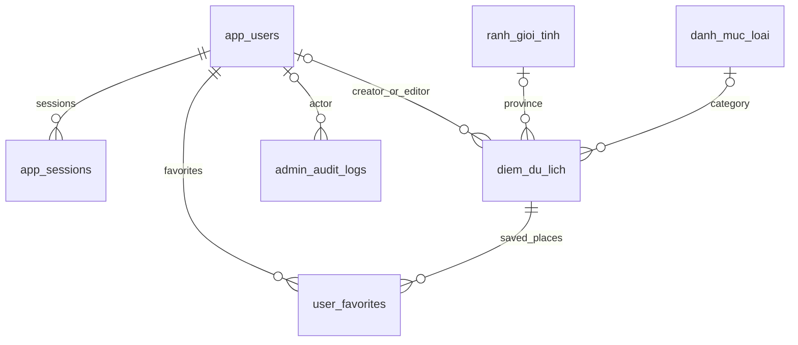

# Tài khoản Google và quản lý dữ liệu

Ứng dụng sử dụng cùng PostgreSQL/Neon với bản đồ. Người dùng đăng nhập Google lần đầu sẽ được tạo tài khoản, những lần sau sử dụng lại tài khoản theo `google_sub`. Không lưu mật khẩu Google hoặc token Google trong database.

## Thiết lập Google

1. Mở [Google Cloud Console](https://console.cloud.google.com/), tạo hoặc chọn project.
2. Trong **Google Auth Platform**, thiết lập **Branding**: tên ứng dụng, email hỗ trợ và thông tin website. Thiết lập **Audience** cho đối tượng dùng ứng dụng; nếu project đang Testing, thêm các tài khoản thử nghiệm cần dùng theo cấu hình của project.
3. Trong **Clients**, chọn **Create client**, loại **Web application**.
4. Thêm **Authorized JavaScript origins**: `http://localhost`, `http://localhost:3000` và tên miền triển khai, ví dụ `https://mapgis.example.com`. Origin gồm giao thức, tên miền và cổng; không có đường dẫn `/account` hay `/admin`.
5. Sao chép **Client ID**, có dạng `123456789-abc.apps.googleusercontent.com`. Luồng hiện tại dùng nút Google và callback JavaScript, không cần Client Secret hoặc redirect URI.

Các bước tạo client và origin theo [hướng dẫn Google Identity Services](https://developers.google.com/identity/gsi/web/guides/get-google-api-clientid). Server xác minh ID token bằng `google-auth-library`, kiểm tra đối tượng nhận token và nonce theo [hướng dẫn xác minh của Google](https://developers.google.com/identity/gsi/web/guides/verify-google-id-token).

Điền vào `.env` hiện có; giữ nguyên `DATABASE_URL`:

```dotenv
GOOGLE_CLIENT_ID=123456789-abc.apps.googleusercontent.com
APP_ORIGIN=http://localhost:3000
ADMIN_EMAILS=your-admin@gmail.com
```

`APP_ORIGIN` phải khớp chính xác origin đang mở trên trình duyệt. Với cấu hình trên, mở `http://localhost:3000`, không dùng `http://127.0.0.1:3000`. Nếu đổi cổng, thay cả `PORT`, `APP_ORIGIN` và origin trong Google. Trên Vercel, thêm các biến này vào Environment Variables cùng `DATABASE_URL`, đặt `APP_ORIGIN` thành tên miền HTTPS chính thức, thêm tên miền đó vào Google rồi redeploy. Không dùng URL preview khác origin để đăng nhập với cấu hình production.

```powershell
npm install
npm run db:init
npm start
```

Mở `http://localhost:3000/account` và chọn Google. Lần đầu đăng nhập bằng email Gmail/Google Workspace đã khai báo trong `ADMIN_EMAILS` sẽ nhận quyền admin; tài khoản khác nhận quyền user. Khai báo email admin trước lần đăng nhập đầu tiên. `ADMIN_EMAILS` không tự nâng quyền tài khoản đã tồn tại và không tự phục hồi quyền đã bị hạ.

Nếu tài khoản đã được tạo trước khi thêm email admin, hoặc dùng Google với email ngoài Gmail/Google Workspace, chủ database có thể cấp quyền sau khi tài khoản đã đăng nhập:

```powershell
npm run users:admin -- your-admin@gmail.com
```

Lệnh yêu cầu đúng một tài khoản đang hoạt động, ghi nhật ký và thu hồi các phiên cũ. Người dùng đăng nhập lại để vào `/admin`. Nếu có nhiều tài khoản cùng email, xác định đúng UUID trong bảng `app_users` và chạy `npm run users:admin -- --id UUID`. Không tự cấp admin cho người đăng ký đầu tiên.

## Các bảng database

Migration: [sql/users-admin.sql](../sql/users-admin.sql). `npm run db:init` có thể chạy lại và không xóa dữ liệu hiện có.

| Bảng | Dữ liệu chính |
| --- | --- |
| `app_users` | UUID, Google subject duy nhất, email đã xác minh, tên Google/tên hiển thị, ảnh đại diện, quyền, trạng thái, thời gian đăng nhập, phiên bản |
| `app_sessions` | Hash mã phiên, người dùng, mã CSRF, thời gian tạo/hết hạn |
| `app_login_challenges` | Hash thử thách đăng nhập, CSRF và nonce; thời hạn 20 phút |
| `user_favorites` | Điểm du lịch đã lưu của từng người dùng; khóa chính ghép chống lưu trùng |
| `admin_audit_logs` | Người thực hiện, thao tác, đối tượng, chi tiết thay đổi và thời gian |
| `diem_du_lich` | Bổ sung `deleted_at`, thời gian tạo/sửa, người tạo/sửa và `version` |



`app_login_challenges` độc lập vì người bắt đầu đăng nhập có thể chưa có tài khoản. Email không là khóa định danh: Google `sub` mới là khóa liên kết tài khoản Google.

## Sử dụng

- Bản đồ → **Yêu thích**: xem các điểm đã lưu và số lượng, lọc theo tên/tỉnh/loại hình, mở điểm trên bản đồ, chỉ đường hoặc bỏ yêu thích. Nút **Thêm vào yêu thích/Bỏ yêu thích** nằm trong popup địa điểm; danh sách và dấu ghim cập nhật ngay sau thao tác. Chưa đăng nhập sẽ hiển thị liên kết đăng nhập.
- `/account`: sửa tên hiển thị, xem/bỏ lưu điểm đến và đăng xuất. Liên kết **Xem trên bản đồ** mở thẳng danh sách yêu thích. Lần đăng nhập đầu tạo tài khoản tự động.
- `/admin` → **Người dùng**: tìm theo tên/email, đổi tên, cấp/hạ quyền, khóa/mở khóa, lưu trữ/khôi phục tài khoản, thu hồi phiên và xem/bỏ các điểm đã lưu của người dùng. Email được đồng bộ từ Google và không sửa thủ công.
- `/admin` → **Điểm du lịch**: tìm kiếm, lọc tỉnh/trạng thái, thêm/sửa tên, loại hình, địa chỉ, mô tả, ảnh và vị trí; chọn tọa độ trên bản đồ hoặc nhập trực tiếp. Server tự xác định tỉnh từ ranh giới PostGIS.
- **Ẩn/Khôi phục** điểm du lịch dùng `deleted_at`. Điểm ẩn không xuất hiện trên API bản đồ, danh sách yêu thích cá nhân hoặc tìm đường. Liên kết nguồn OSM và dữ liệu đã lưu vẫn được giữ để khôi phục.
- **Nhật ký quản trị**: xem người thực hiện và các thao tác quản lý. Chi tiết JSON được lưu ở `admin_audit_logs.changes`.

Sau khi sửa điểm đến trong trang admin, tải lại bản đồ để lấy dữ liệu mới. Import mặc định giữ chỉnh sửa thủ công; `npm run data:refresh` ghi đè nội dung theo nguồn OSM và tăng phiên bản nhưng giữ trạng thái ẩn.

## API và phân quyền

| API | Quyền |
| --- | --- |
| `GET /api/auth/config`, `POST /api/auth/google`, `GET /api/auth/me` | Công khai; đăng nhập kiểm tra thử thách và ID token |
| `POST /api/auth/logout`, `PATCH /api/me/profile` | Người dùng đang đăng nhập |
| `GET /api/me/favorites`, `PUT/DELETE /api/me/favorites/:id` | Chỉ dữ liệu của người dùng đang đăng nhập |
| `GET /api/admin/stats`, `/options`, `/users`, `/users/:id`, `/tourism`, `/audit` | Admin đang hoạt động |
| `PATCH /api/admin/users/:id` | Admin; kiểm tra phiên bản và bảo vệ quyền admin |
| `POST /api/admin/users/:id/revoke-sessions` | Admin |
| `DELETE /api/admin/users/:id/favorites/:placeId` | Admin |
| `POST /api/admin/tourism`, `PATCH /api/admin/tourism/:id` | Admin |
| `PATCH /api/admin/tourism/:id/visibility` | Admin |

Phiên sống 7 ngày, lưu bằng cookie HttpOnly/SameSite=Lax; HTTPS bật Secure và tiền tố `__Host-`. Database chỉ lưu hash mã phiên. Các API ghi kiểm tra `Origin` và `X-CSRF-Token`; API riêng trả `Cache-Control: no-store`. Các thao tác admin ghi dữ liệu và nhật ký trong cùng transaction. Trường `version` ngăn ghi đè chỉnh sửa cũ; khi nhận lỗi xung đột, tải lại danh sách trước khi sửa tiếp.

Khóa/lưu trữ người dùng hoặc đổi quyền sẽ thu hồi phiên. Không thể tự hạ quyền/khóa tài khoản admin đang đăng nhập và phải giữ ít nhất một admin đang hoạt động. Trang `/admin` chỉ là giao diện; toàn bộ API dữ liệu kiểm tra quyền ở server.

## Kiểm tra

```powershell
npm run users:test
npm run favorites:test
npm run users:verify
npm run data:test
npm run roads:test
npm run data:verify
```

`users:test` kiểm tra đăng ký, phiên, CSRF, phân quyền, yêu thích và thêm/sửa/ẩn/khôi phục điểm du lịch trên schema riêng trong transaction rollback của database cấu hình. Nó dùng bộ xác minh token giả lập trong fixture kiểm thử và không thay đổi tài khoản/dữ liệu thật. Đăng nhập Google thật cần Client ID hợp lệ và phải thử trực tiếp trên `/account` sau khi cấu hình.

`users:verify` kiểm tra các bảng trên Neon, truy cập trang/asset, chặn API riêng khi chưa đăng nhập và đối chiếu số điểm/tỉnh hiển thị với database. Nếu Google đã cấu hình, lệnh tạo thử thách đăng nhập ngắn hạn; không tạo người dùng hoặc sửa điểm du lịch.

`favorites:test` kiểm tra thêm/bỏ yêu thích, bộ lọc danh sách và dấu ghim, nút đăng nhập, và loại bỏ phản hồi cũ khi đăng xuất/chuyển tài khoản bằng fixture DOM và API.
